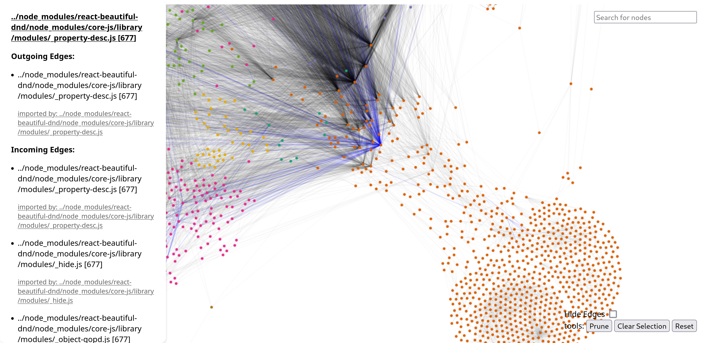
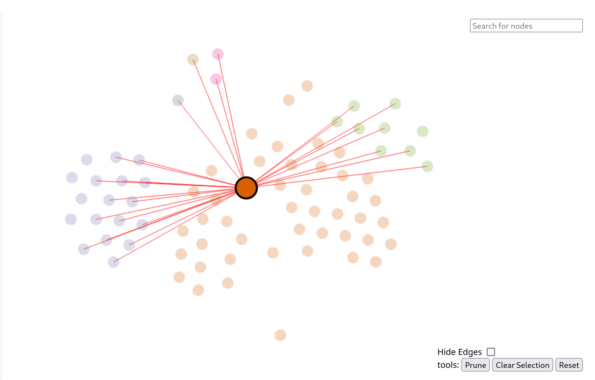

# Webpack Stats

Webpack compilation statistics tooling. 

## CLI 

### List all available entrypoints
```
> webpack-q stats.json list-entrypoints
entry-1:
  chunks:
  511
  603
  411
  
entry-2:
  chunks:
  553
  511
  603
```
### Describe a single entrypoint 
Show the chunk graph for a single entrypoint
```
react-app-init:
Initial size (uncompressed): 25.209415 MiB
Chunk Imports (* denotes asynchronous chunk):
├── 677 (1.4475832 MiB) [667-03ce85aefb0fc941b387.js ]
    ├── 9710 (6.102539 MiB) [9710-c6ff2448139ca25af0fd.js,]
        ├── 9710 (6.102539 MiB) [teacher-c6ff2448139ca25af0fd.js,]
        ├*- 8531 (1.9375 KiB) [8531-ddf76b7aa317e31c4ab8.js,]
        ├*- 8378 (21.391602 KiB) [8378-011d566da73967dfe9dc.js,]
            ├*- 8326 (868.4404 KiB) [8326-312307f999168a94f725.js,]
                ├*- 8334 (725.5176 KiB) [8334-416c2214d47f892bd20d.js,]
                    ├*- 8182 (1.15102 MiB) [lantern-b79790621933d372cb89.js,]
     
```

## Fully traverse a graph 
Full graph traversal in html

```
# Output a graphviz dot file 
webpack-q stats.json traverse-entrypoint entry-1 -fdot

#output json
webpack-q stats.json traverse-entrypoint entry-1 -fjson

#output html viz with d3
webpack-q stats.json traverse-entrypoint entry-1 -fhtml
```

### Find the ways that an entrypoint arrives at a chunk
Useful for finding out why your commons chunk has been imported on
initial page load. HTML viz shows forces between chunks and makes it easy 
to spot offenders

```
webpack-q stats.json paths-to-chunk my-entrypoint 5332
```
In this example, the node in the middle clearly joins multiple chunks together.
Splitting it up may improve load performance. 



## Roadmap 

### More webpack stats compatibility 
Repo already contains sample stats.json files that can be encoded 

* [x] V5
* [ ] V4
* [ ] V3
* [ ] V2
* [ ] V1

